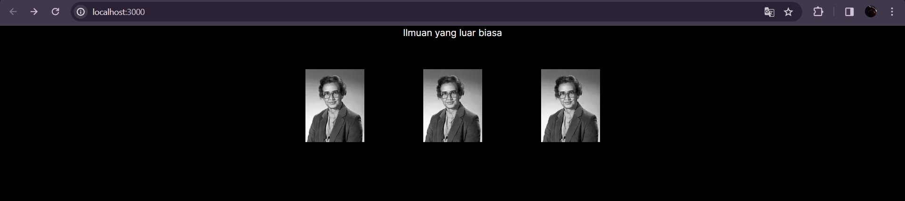
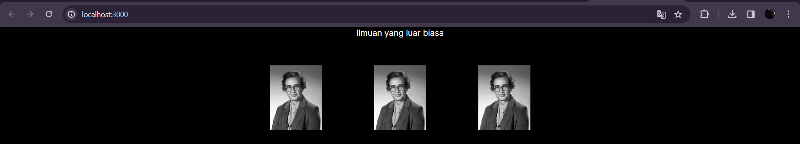
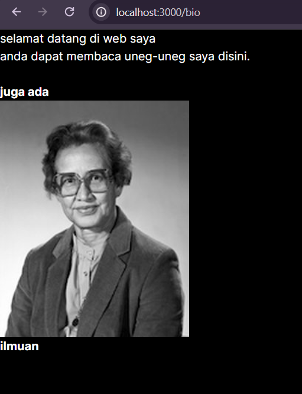
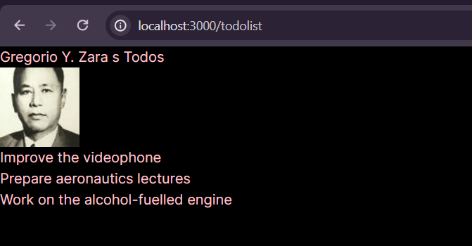
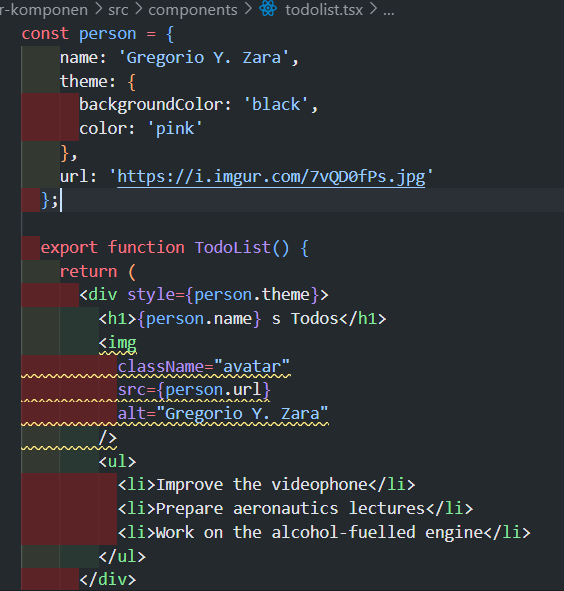
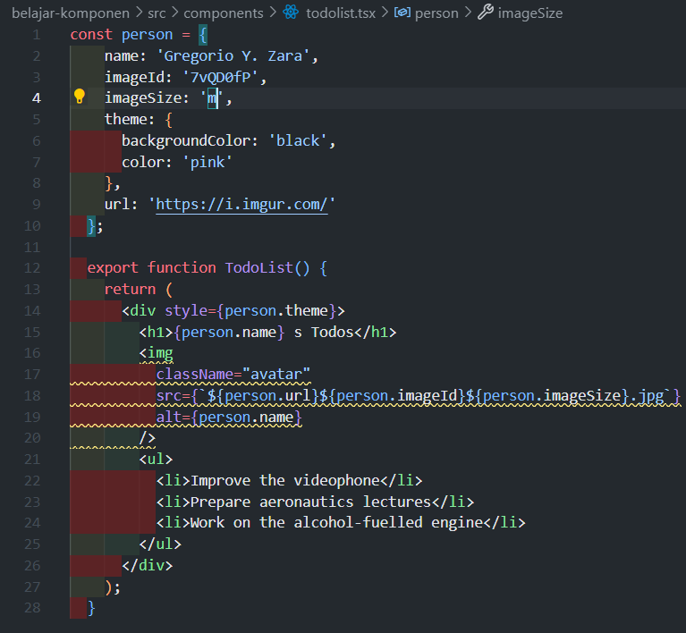
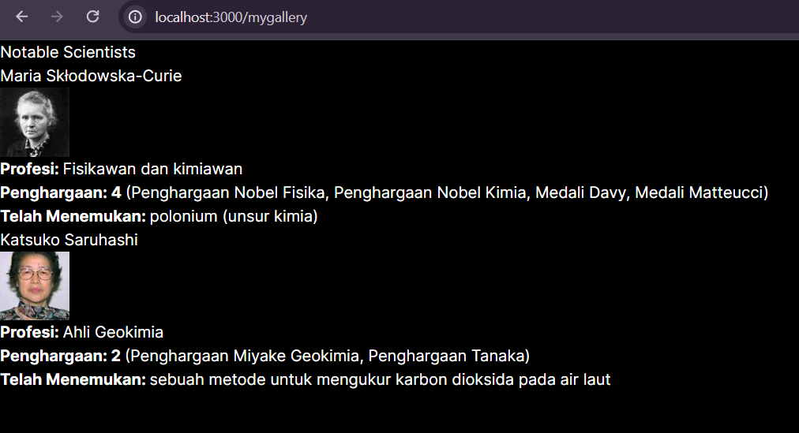
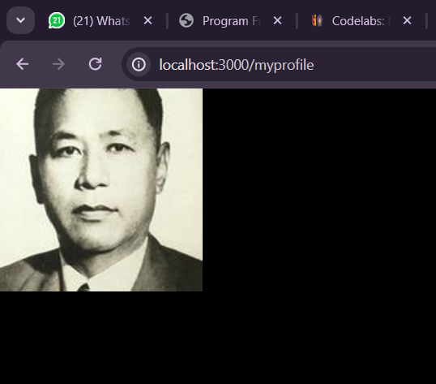
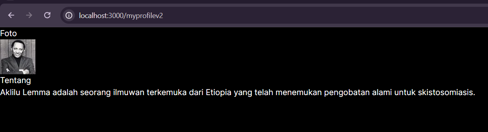

|  | Pemrograman Berbasis Framework |
|--|--|
| NIM | 2141720248 |
| Nama | Zhubair Abhel |
| Kelas | TI - 3C |

### Jawaban

        Error: Invalid src prop (https://i.imgur.com/MK3eW3Am.jpg) on `next/image`, hostname "i.imgur.com" is not configured under images in your `next.config.js`
        See more info: https://nextjs.org/docs/messages/next-image-unconfigured-host

    karena konfigurasi yang diperlukan untuk menggunakan gambar dari hostname "i.imgur.com" belum ditambahkan ke dalam file next.config.js
    untuk memperbaiki error tersebut yaitu dengan cara menambahkan hostname "i.imgur.com" ke dalam konfigurasi images di file next.config.js 

### Jawaban Soal 2

untuk hasil tampilannya sama 

### Jawaban Soal 3

error tersebut bisa terjadi karena seperti yang sudah dijelaskan tadi bahwa class merupakan nama pesanan, di React kita menulisnya sebagai className

### Jawaban Soal 4

### Jawaban Soal 5

 hasilnya tetap sama

### Jawaban Soal 6

### Jawaban Soal 7

### Jawaban Soal 8

### Jawaban Soal 9
